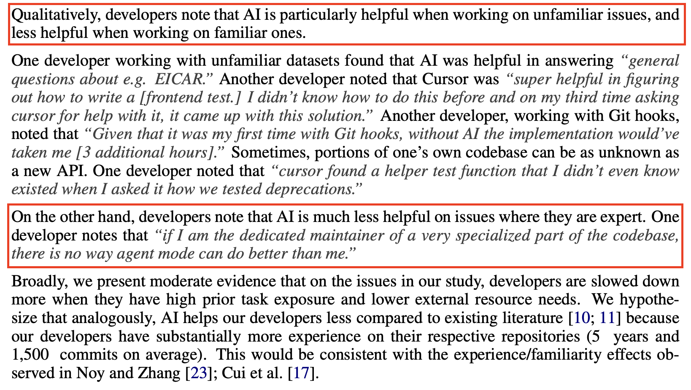
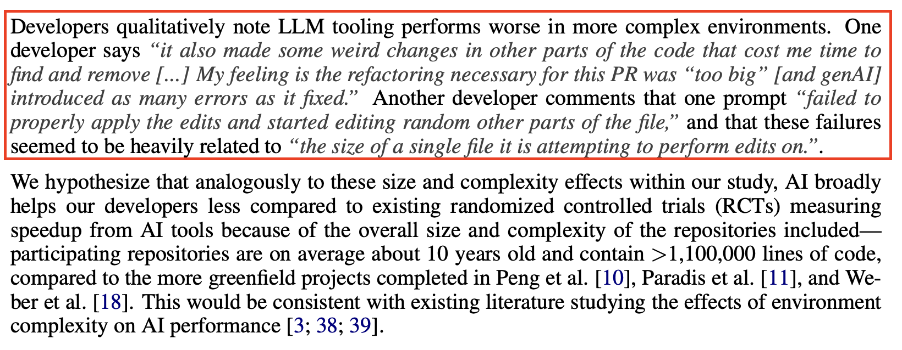
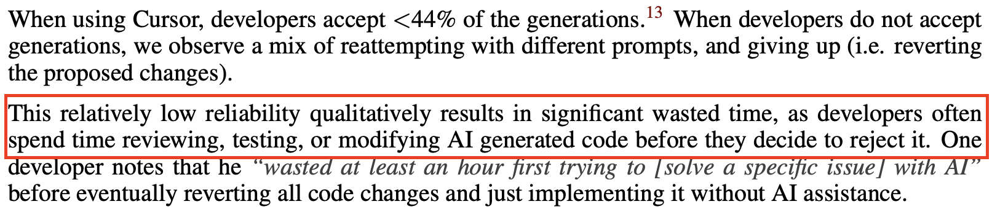
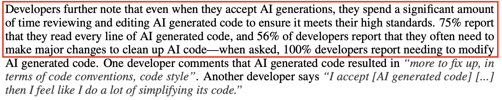
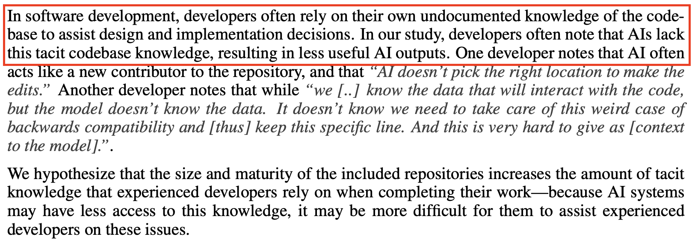
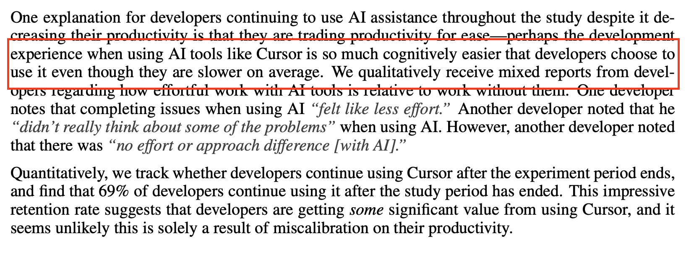
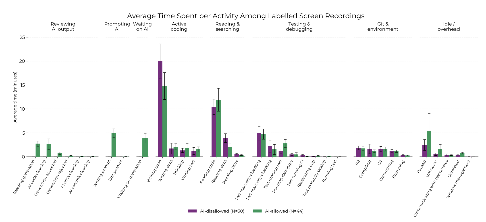

# AI Daily Retrospective - 2025-07-21

## **What new things did I test/apply today in the context of AI/systems?**

- I refined [CLAUDE.md](http://CLAUDE.md) so that the commit no longer contains information that it was done with Claude
- I refined [CLAUDE.md](http://CLAUDE.md) so that with every commit, phpstan and phpcsfixer are run automatically

## **What specifically worked, and what was difficult?**

When refactoring the listener class, which was supposed to report only technical errors to Sentry, I pointed out to Claude a specific refactoring method and then, in one go, he reworked the class as needed. Previously, I very generally told him to refactor to make it DRY—there were repetitions in the methods. He did it, but it wasn't an elegant solution. He couldn't find the right refactoring himself. This makes me think that a human factor and HARD knowledge are still needed. The LLM, if you tell it what to do, will do it, but it still can't think and fit the pieces together like a human. Interestingly, the LLM knows these methods very well—whenever I ask, it always explains them to me. However, it can't figure out that it should use them in this context. But as soon as I ask if it knows Xxxx, it says: Aha, indeed, this fits perfectly here and starts coding.

## **What observation/conclusion do I take from today?**

I read the results of the study "[Measuring the Impact of Early-2025 AI on Experienced Open-Source Developer Productivity](https://arxiv.org/abs/2507.09089)". Below are some interesting insights from the article.

**AI helps with unfamiliar tasks, less with familiar ones**

**AI tooling struggles in large, complex coding environments**

**Low AI reliability wastes time on review and rejection**

**Developers spend significant time reviewing and editing AI code**

**AI lacks developers' tacit codebase knowledge, reducing usefulness**

**Developers prefer AI tools for ease despite slower productivity**

**Developers with AI spend more time reviewing, prompting, and waiting on AI, but less time on active coding and testing compared to those without AI**

[Post on the guild](https://boldare.slack.com/archives/C08ABRM1PAB/p1753087270864559)

## **How can I use this learning tomorrow/in the future?**

- Claude needs to be taught the codebase so he understands it better
- Claude speeds me up in tasks I encounter for the first time
- Consider a day without AI to maintain the ability to code independently—maybe this will help me avoid the trap of using AI even when I could write some things faster myself than by laboriously prompting
- It's STILL worth learning and knowing refactoring methods—it speeds up refactoring with LLM. I can give a more general prompt: "Do split phase refactoring" instead of laboriously prompting changes step by step.
- I think a better approach is to review change by change, instead of letting the LLM code for a long time and only reviewing a larger batch at the end. The sooner we make corrections, the less loss—just like with tests and TDD.
