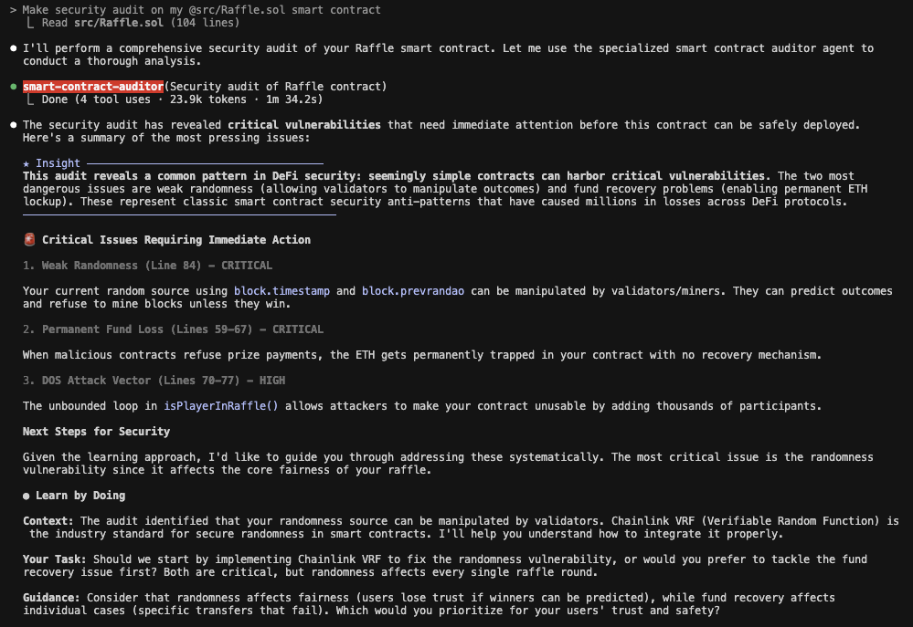

# AI Daily Retrospective - 2025-08-25

## **What new things did I test/apply today in the context of AI/systems?**
- Explored Claude Code subagents functionality - a way to create specialized AI assistants for specific tasks with their own context windows and tool permissions
- Discovered Claude Code output styles feature - different modes that modify the system prompt to adapt Claude Code for uses beyond software engineering ([docs](https://docs.anthropic.com/en/docs/claude-code/output-styles))
- Want to implement a minimal subagent setup today to test how task delegation works in practice
- Added to testing list: Try `Learning` output style in Solidity project (collaborative mode with TODO(human) markers) and `Explanatory` style in Bab project (educational insights between tasks)

## **What specifically worked, and what was difficult?**
- The main challenge I'm facing is that I don't really know what practical use cases I can apply subagents to. I see a lot of flashy examples online, but they don't really resonate with me yet. The complex workflows presented by YouTubers seem overly complicated for my initial impression, and I don't see practical applications for them in my daily work. However, I don't want to give up on this technology - I need to find some real application for subagents in my projects, but one that actually solves a genuine problem I have rather than an artificial one.

## **What observation/conclusion do I take from today?**
- Successfully tested Shift+Tab in Claude Code to switch to `plan mode` for planning before implementation. I see real value in this as Claude Code doesn't immediately jump into implementation and always presents me with a consistent way to see the thinking and planning process. I will definitely be using this going forward.
- Started using output styles. It worked really well for learning Solidity when I enabled `learning` mode. Claude Code started requiring me to implement parts myself - it would complete portions of tasks and leave me with things to finish. This gives me the opportunity to write code independently, which should translate to more solid knowledge compared to just watching Claude Code write and occasionally correcting it.
- Created my first subagent "Smart Contract Auditor". I have no experience in this area yet, so the LLM is extremely useful here as it has more knowledge than I do. This is exactly the big advantage of AI - it has knowledge across many topics, so when I don't have expertise, it's better than nothing. It helped me find 3 critical bugs, one of which is intentional (randomness). This will be the next iteration once I publish the contract on testnet to develop it iteratively with a "walking skeleton" approach.

## **How can I use this learning tomorrow/in the future?**
- Continue using `plan mode` (Shift+Tab) consistently in Claude Code for all new projects - this structured approach to planning before implementation has proven valuable and helps maintain clear thinking processes
- Experiment with different `output styles` across various projects to find optimal configurations for different contexts. Consider creating custom output styles tailored to specific workflows or project types that could enhance productivity
- Develop specialized subagents for domains where I lack expertise - like the "Smart Contract Auditor" example. This approach leverages AI's broad knowledge base to compensate for my knowledge gaps, making it possible to work effectively in areas I'm still learning. The key insight is that having an AI assistant with domain expertise is always better than working with no guidance at all
